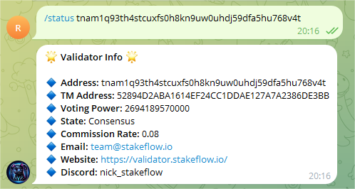
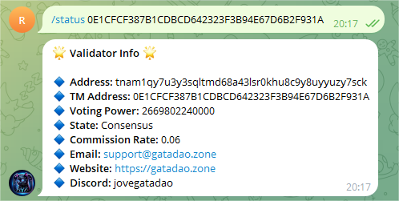

# Telegram Bot for Namada Validators

This project is a Telegram bot designed to monitor validators on the Namada blockchain. It provides functionality such as querying validator statuses, monitoring validators for changes, and notifying users about state and commission rate changes. The bot uses a MySQL database to manage user subscriptions and validator data.
## High Lights

- **Direct Blockchain Queries**
  
  Custom API integration allows fetching validator data directly from the blockchain with **ABCI query**, without relying on node command-line interfaces. Although primarily focused on validator data now, it paves the way for expanding to other Namada data types and blockchain interactions in Python. 

- **Extensible Telegram Bot Interface**
  
  Designed for expansion, the bot can easily incorporate additional notifications, like governance proposals, making it versatile for various monitoring needs.

## Table of Contents
- [Features](#features)
- [Project Structure](#project-structure)
- [Getting Started](#getting-started)
  - [Prerequisites](#prerequisites)
  - [Installation](#installation)
- [Usage](#usage)
  - [Setting Up the .env File](#setting-up-the-env-file)
  - [Running the Bot](#running-the-bot)
  - [Telegram Commands](#telegram-commands)
- [Bot Usage Examples](#bot-usage-examples)


## Features

- Query validator status using either Namada or Tendermint addresses.
- Monitor validators for changes in state and commission rates.
- Receive notifications on monitored validators.

## Project Structure
```python
telegram_bot_project/
├── db/ 
│ ├── __init__.py
│ └── database_manager.py
├── config/ 
│ ├── __init__.py
│ └── settings.py 
├── nam_lib/                 # Namada blockchain interactions
│ ├── __init__.py
│ ├── client.py
│ ├── namada_api.py
│ └── result.py
├── service/                 # Core bot services
│ ├── __init__.py
│ ├── bot_commands.py          # Telegram bot commands and logic
│ ├── update_database.py       # Service for fetching blockchain data and updating the database
│ ├── init_database.py         # Initializes the database, runs at the start of the program
│ └── notify_users.py          # Service for notifying users based on their subscriptions and changes detected
├── structs/                 # Rust Types written in Python
│ ├── __init__.py
│ ├── basic.py
│ ├── bech32m.py               
│ ├── commission_rate.py       
│ └── storage_proposal.py      # Placeholder for future implementation
├── example.env              # Template for environment variables
├── setup_environment.sh     # Script for setting up prerequisites and environment
├── main.py                  # Entry point of the application
└── requirements.txt         # Python dependencies
```
This structure supports modular development by separating concerns: db handles database operations, nam_lib interacts with the Namada blockchain, service contains the application logic including bot interactions and data updates, and config manages the application configuration.
## Getting Started

### Prerequisites

- Python 3.6 or higher
- MySQL Server
- Telegram Bot Token (You can get one from [@BotFather](https://t.me/botfather))

### Installation

- 1. Clone the repository:

```bash
git clone https://github.com/LUNA007KING/Namada_Telegram_Validator_Bot.git
cd Namada_Telegram_Validator_Bot
```

- 2. Run the setup_environment.sh script to install Python, Python packages, and set up MySQL:

```bash
chmod +x setup_environment.sh
./setup_environment.sh
```

- 3. Create and activate a Python virtual environment:
Before installing the dependencies, it's recommended to create a Python virtual environment to isolate the project dependencies.

```bash
python3 -m venv venv
source venv/bin/activate
```

- 4. Install Python dependencies:

```bash
pip install -r requirements.txt
```

- 5. Copy the example.env file to .env and update it with your database credentials and bot token:

```bash
cp example.env .env
# Edit .env with your database credentials and bot token
```
The .env file contains important configuration values. Fill in the values according to your environment:
- `TELEGRAM_BOT_TOKEN`: Your Telegram bot token.
- `NAMADA_RPC_URL`: The RPC URL for the Namada blockchain.
- Database configurations (`DB_USER`, `DB_PASSWORD`, etc.).


## Usage

### Running the Bot
To start the bot, run:
```python
python main.py
```

### Telegram Commands
- `/start`: Welcomes the user and provides information on available commands.
- `/status` [address]: Checks the current status of a validator.
- `/monitor` [address]: Starts monitoring a validator.
- `/view`: Views the status of all monitored validators.
- `/stop` [address|all]: Stops monitoring a validator or all validators.

## Bot Usage Examples
- **start**
  
  

- **status [operator address]**: Query the status of a validator using the operator address. 

  

- **status [tendermint address]**: Query the status of a validator using the Tendermint address. 

  

- **monitor [address]**: Start monitoring a validator to receive alerts on status changes like state or commission updates.

  

- **view**: View the status of monitored validators, displaying a list and summary of each.

  

- **stop [address]**: Stop monitoring a specific validator by providing its address (Operator or Tendermint) to unsubscribe.

  

- **stop all**: Stop monitoring all validators by deleting all subscriptions, halting all notifications.

  
